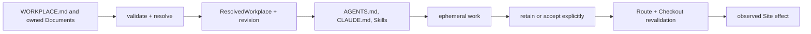

# Endroit

Endroit is a local-first compiler for human-owned workplace context. You write
small, readable Markdown sources; Endroit validates and resolves the relevant
ones, then builds compact projections for Codex, Claude and local tools.

> `0.10.0-alpha.0` is a local release candidate. It has not been published or
> deployed by this branch.

## The golden slice



Open Workplace defines only shared responsibilities: durable boundaries,
ownership, authority, source versus projection, temporary execution, explicit
transitions, external authorities and resolution states. The concrete
vocabulary below belongs to the Endroit Profile.

| Term | Meaning |
| --- | --- |
| Workplace | One durable declared boundary rooted at `WORKPLACE.md`. |
| Member | A durable human identity. |
| Desk | Optional local continuity and Route ownership for one Member. |
| Room | A durable domain with its own mission and Material. |
| Equipment | Reusable method, Capability and provider surface. |
| Material | Durable addressable content with an explicit owner. |
| Artifact | Material whose Endroit kind adds useful validation. |
| Site | A sovereign external authority, usually a Git repository. |
| Route | A Desk-owned relationship to one Site. |
| Checkout | The derived local address of a Route, never canonical truth. |
| Meeting | The current ephemeral work event. |

`Home`, `Instance` and `Mount` are legacy product terms. A future UI may
use “home” only for an accueil view.

## Source model

Human-owned durable truth uses Markdown where the 0.10 writer is available:

- frontmatter carries identity, owner, contract and resolution metadata;
- the Markdown body carries human context and substance;
- a typed Fragment is an addressable section that inherits its Document owner
  and lifecycle;
- a Fragment becomes Material when it needs independent ownership or lifecycle;
- Material becomes an Artifact only when a registered kind adds useful
  validation.

JSON is reserved for schemas, machine manifests, projection and migration
receipts, locks, caches, CLI/API responses, externally imposed formats and
the explicitly documented 0.10 compatibility surfaces. Endroit never writes a
new JSON and Markdown source for the same responsibility.

| Document role | Canonical | Form |
| --- | --- | --- |
| Declaration | yes | Markdown |
| Material | yes | Markdown |
| Artifact | yes | Markdown plus schema |
| Projection | no | Markdown, JSON or provider format |
| Site-native | yes for its Site | Site-owned format |

Repository documentation such as this README is Endroit-owned source. A public
documentation site may project it, pinning repository, commit, source digest,
transform version and output digest.

## Files

```text
WORKPLACE.md
members/<member>/MEMBER.md
rooms/<room>/ROOM.md
equipment/<equipment>/equipment.json
sites/<site>/SITE.md
.desk/DESK.md
.desk/routes/<site>/<route>/ROUTE.md
checkouts/<site>/<route>
.endroit/checkout-index.json
.endroit/build.json
AGENTS.md
CLAUDE.md
```

`WORKPLACE.md`, Member, Desk, Room, Site and Route Documents are sources.
Equipment manifests remain machine configuration. `AGENTS.md`,
`CLAUDE.md`, Skills, the console and `.endroit/` receipts are rebuildable
projections or local state.

## Start

Requirements: Node.js 22 or 24 and Git.

```sh
npx --yes --package @endroit/cli@0.10.0-alpha.0 \
  endroit create my-workplace --desk tracked

cd my-workplace
node ./endroit.mjs validate
node ./endroit.mjs build --check
node ./endroit.mjs doctor
```

Use `endroit init <repository>` when the selected repository should also
contain the Workplace. Read [INSTALL.md](INSTALL.md) for exact options and
[ADOPT.md](ADOPT.md) before selecting a new boundary.

The canonical direct selector is `--workplace` or
`ENDROIT_WORKPLACE_PATH`. Deprecated `--home` and
`ENDROIT_HOME_PATH` aliases remain read-compatible in 0.10 and are scheduled
for removal in 0.11.

## Resolution and build

Discovery starts from the selected directory, walks physical parents and stops
at the first `WORKPLACE.md` marked `kind: "endroit/workplace"`. An invalid
marked candidate is a boundary error. Endroit never searches children, follows
a Route or crosses repositories during discovery.

Resolution yields `resolved`, `degraded` or `ambiguous`. Its revision is
derived from the Profile, runtime and sorted relative source paths plus
SHA-256 digests. Absolute paths, timestamps, Git state and host observations do
not affect it.

`build` resolves, validates fixed context budgets, renders projections,
checks collisions, writes atomically and records `.endroit/build.json`.
Repeated builds from the same sources are byte-identical. Build never installs
provider hooks or edits Git configuration.

Provider bootstraps are limited to 4 KiB. They contain identity, Profile,
protocol, revision, concise Constitution, source/projection rules, minimal
routing and degraded behavior—not the complete Profile, Room/Site inventory or
absolute paths.

## Sites, Routes and Checkouts

A Route v9 source is pathless:

```markdown
---
$schema: "https://endroit.org/schema/v9/route.json"
kind: "endroit/route"
id: "main"
owner: "desk:alexis"
site: "product"
route_state: "active"
checkout_mode: "existing"
revision: {"kind":"branch","name":"main"}
---

# product / main

Local address: `checkout:product/main`.
```

Every non-embedded Route uses `checkouts/<site>/<route>`. Managed clones and
worktrees are physical directories; existing checkouts may be linked; a
submodule may occupy the address directly. Durable content references use
`checkout:<site>/<route>#<relative-path>`; absolute paths and `..` escapes
are rejected.

The local checkout index is partitioned by Desk. It remembers each Desk's
explicit binding while one conventional address represents the currently
selected Desk. `checkout reconcile` may restore a lost generated link from
that Desk-owned index. It never adopts an unindexed symlink, deletes an unknown
link or scans arbitrary project directories.

Git remains authoritative for repository identity, HEAD, branches, worktrees
and dirty state. Endroit inspects extra worktrees only through already-known
Site repositories. Access never grants mutation or delivery authority.

## Work and completion

`WORK.md` is the human-owned Work source. Typed `endroit` code blocks attach
queryable structure to Markdown sections. Initial Fragment kinds are
`source`, `claim`, `obligation`, `contradiction`, `assignment`,
`verification`, `observed_result` and `review`.

Completion is calculated for an exact `(contract, revision, evidence)` tuple;
it is never persisted as a final boolean. Independent axes are:

- resolution: `candidate | resolved | degraded | ambiguous`;
- Material lifecycle: `ephemeral | retained | archived`;
- currentness: `current | superseded | withdrawn`;
- claim maturity: `proposed | supported | demonstrated`;
- Work activity: `active | paused | closed`;
- completion: `complete | incomplete | blocked`;
- delivery observation: `succeeded | partial | failed`.

Acceptance records human authority over an exact revision. Delivery records an
observed Site effect. Neither implies completion, currentness or archival.

## Compatibility

0.10 reads frozen v7/v8 sources only when no v9 source claims the same
responsibility. Its native writers currently cover Workplace, Member, Desk and
Route Documents plus `WORK.md` v1alpha2. Bundled Room, Site and most Equipment
and Artifact operations retain their compatible source shapes in this alpha;
they do not have a general v9 migration command. Endroit never dual-writes.

Route migration supports an effect-free preview, a local journaled apply and
byte/mode-exact rollback without Git effects. There is no supported in-place
whole-Workplace migration in this candidate.

- [Documentation map](docs/README.md)
- [Core concepts](docs/concepts.md)
- [0.10 architecture](docs/architecture.md)
- [CLI and file reference](docs/reference.md)
- [Lifecycles](docs/lifecycles.md)
- [0.9 → 0.10 compatibility and migration](docs/migration-0.10.md)
- [Route v8 → v9 migration](docs/migration-route-v9.md)
- [Work Resolution](docs/work-resolution.md)
- [Provider evidence](docs/providers.md)
- [Endroit Profile](PROFILE.md)

## Limits

Endroit is not an agent runtime, universal memory, workflow scheduler, daemon,
authority broker, repository owner or proof of provider execution. It does not
infer retention, acceptance, commits, delivery, publication or deployment.
