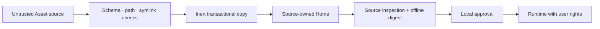

# Security policy

Hairness `0.6.0-alpha.0` is prerelease software. Report vulnerabilities through
[GitHub Security Advisories](https://github.com/thevzion/hairness/security/advisories/new).
Do not disclose credentials, private Home content or unpublished Assets in a
public issue.

## Trust model

Static Asset material is untrusted input. Hairness validates it before copying
or projecting it. Asset runtimes are executable programs with the user’s rights.
Hairness does not claim to sandbox them.

## Enforced controls

- Schemas reject unknown fields and malformed contracts.
- Source and destination checks reject escaping paths and symbolic links.
- Canonical `HOME.md` and `DESK.md` sources must be non-empty regular UTF-8
  files; symlinks and incomplete Desks are rejected before composition.
- HTTPS sources reject credentials and query strings; redirects remain HTTPS.
- Asset writes are staged, backed up and restored after failed promotion.
- Local divergence blocks sync, remove and override publication unless the
  explicit lifecycle permits replacement.
- Unknown local files survive sync and remove.
- `asset validate`, `add`, `sync`, `build`, `doctor` and resolution execute no
  Asset runtime.
- Front Door routes are resolved from the effective composition; Asset
  mutations that would break the selected runtime or command fail before
  writing.
- Runtime trust is `bundled`, `approved` or `pending`. `bundled` requires byte
  equality with the Asset in the exact pinned npm package. `approved` requires
  a matching local digest approval. `pending` blocks execution.
- A changed byte invalidates local approval and returns the runtime to
  `pending`.
- Provider projections are fully owned and digest-tracked; direct edits block
  reconciliation instead of being preserved or overwritten.
- Context budgets fail validation and build when explicitly configured.
- Target Bindings verify normalized Git remote identity.
- Target Map generation reads tracked paths, is bounded, rejects secret-like
  output and writes only to the Desk.
- Desk recent-file discovery does not follow symbolic links.
- HUD probes use local evidence only, execute no other Asset runtime and
  separate blocking, warning and advisory attention.
- The tracked Home Console accepts a development launcher only as a regular,
  non-symlink file and never falls back to npm when that launcher is broken.
- SessionStart Bridges execute only the Home-selected Wake-up route, cap stdout
  at 256 KiB, discard runtime stderr and expire after 30 seconds.
- Wake-up failure yields a bounded degraded marker; the static Floor Plan
  remains available.

## Runtime boundary

An approved runtime receives absolute Home, Desk and Asset paths plus the
Resolved Home. It inherits the process environment and can perform anything the
user can perform. Review its source and dependencies before approval. Use an
operating-system sandbox or disposable environment when the author is not
trusted.

Provider sessions and their tools are also outside Hairness authority. A
composed Home does not authorize Ness to modify a Target or access a service.
Provider hook approval is also outside Hairness authority; Doctor verifies the
projected files, not the provider's global consent state.

## User responsibilities

Commit before changing shared Assets. Prefer pinned Git sources for
reproducibility. Run `asset validate` before installation, inspect source-owned
runtime files, use offline `asset status` for the effective digest and
`asset sync --check` for upstream diffs.
Protect Home and Desk repositories according to the sensitivity of their
agentic assets and Artifacts. Never commit credentials to an Asset, Home, Desk,
Artifact or Target Map.
