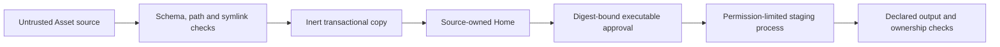

# Security policy

Hairness `0.5.0-alpha.0` is prerelease software. Report vulnerabilities through
[GitHub Security Advisories](https://github.com/thevzion/hairness/security/advisories/new).
Do not put credentials, private Home content or unpublished company Assets in
a public issue.

## Trust model

Hairness treats manifests and static files as untrusted input. An executable
Asset becomes trusted code only after local approval for its current digest.
Provider sessions and their tools remain outside Hairness authority.

## Enforced controls

- JSON schemas reject unknown manifest fields and invalid settings.
- Source and destination checks reject escaping paths, duplicate destinations
  and symbolic links.
- HTTPS sources reject credentials and query strings. Redirects must remain on
  HTTPS.
- Asset add, status, diff, sync, remove, setup, resolution and HUD execute no
  Asset code.
- File transactions stage writes, back up touched paths and restore them after
  a failed promotion.
- Sync and remove stop on local divergence unless the user passes
  `--overwrite`. Undeclared files survive.
- Publishing a Desk override stops when its Home base digest changed.
- Multi-file Artifact imports reject symlinks, escaping paths, reserved
  metadata and incomplete required file sets.
- `build --check` and `asset sync --check` write nothing.
- Executable approval covers the current Asset tree. A change revokes approval.
- Node's permission model limits executable filesystem reads to the Asset and
  writes to staging. Hairness also limits runtime and output size.
- Promotion rejects undeclared, reserved, symbolic-link or colliding output.
- Target Bindings verify normalized Git remotes before connecting a checkout.
  Managed clone deletion requires explicit consent and a clean worktree.
- Target Map generation reads tracked paths and bounded package metadata,
  secret-scans staged output and never writes into the Target.
- Integration bindings select accessors and store no credentials.
- Provider projections omit a surface when the provider cannot preserve its
  invocation policy. The user must record lossy consent to widen access.

## Boundaries

Hairness cannot control an agent after a provider starts it. A composed Home
does not authorize the agent to change a Target or use an Integration.

The Node permission model limits direct filesystem access from an executable.
An Asset can request `child-process`; the manifest and approval expose that
wider boundary. A child process does not inherit Node's filesystem restrictions.
Approve that permission only when you trust the Asset and the invoked program.

Keep a Home in Git. Pin Git sources with a tag or full commit when
reproducibility matters. Review source diffs and executable code. Protect the
Home and Desk repositories according to the sensitivity of their agentic
material.
