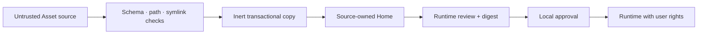

# Security policy

Hairness `0.5.0-alpha.0` is prerelease software. Report vulnerabilities through
[GitHub Security Advisories](https://github.com/thevzion/hairness/security/advisories/new).
Do not disclose credentials, private Home content or unpublished Assets in a
public issue.

## Trust model

Static Asset material is untrusted input. Hairness validates it before copying
or projecting it. Asset runtimes are executable programs with the user’s rights.
Hairness does not claim to sandbox them.

## Enforced controls

- Schemas reject unknown fields and malformed contracts.
- Source and destination checks reject escaping paths and symbolic links.
- HTTPS sources reject credentials and query strings; redirects remain HTTPS.
- Asset writes are staged, backed up and restored after failed promotion.
- Local divergence blocks sync, remove and override publication unless the
  explicit lifecycle permits replacement.
- Unknown local files survive sync and remove.
- `add`, `sync`, `build`, `doctor`, HUD and resolution execute no Asset runtime.
- Runtime approval is local and keyed by the complete installed Asset digest.
  A changed byte invalidates approval.
- Exact first-party runtime trust requires byte equality with the Asset bundled
  in the Home’s exact pinned CLI distribution.
- Provider projections track owners and digests; edits to owned output block
  reconciliation.
- Context budgets fail validation and build when explicitly configured.
- Target Bindings verify normalized Git remote identity.
- Target Map generation reads tracked paths, is bounded, rejects secret-like
  output and writes only to the Desk.
- Desk recent-file discovery does not follow symbolic links.

## Runtime boundary

An approved runtime receives absolute Home, Desk and Asset paths plus the
Resolved Home. It inherits the process environment and can perform anything the
user can perform. Review its source and dependencies before approval. Use an
operating-system sandbox or disposable environment when the author is not
trusted.

Provider sessions and their tools are also outside Hairness authority. A
composed Home does not authorize Ness to modify a Target or access a service.

## User responsibilities

Commit before changing shared Assets. Prefer pinned Git sources for
reproducibility. Inspect `asset review`, source diffs and runtime entrypoints.
Protect Home and Desk repositories according to the sensitivity of their
agentic assets and Artifacts. Never commit credentials to an Asset, Home, Desk,
Artifact or Target Map.
