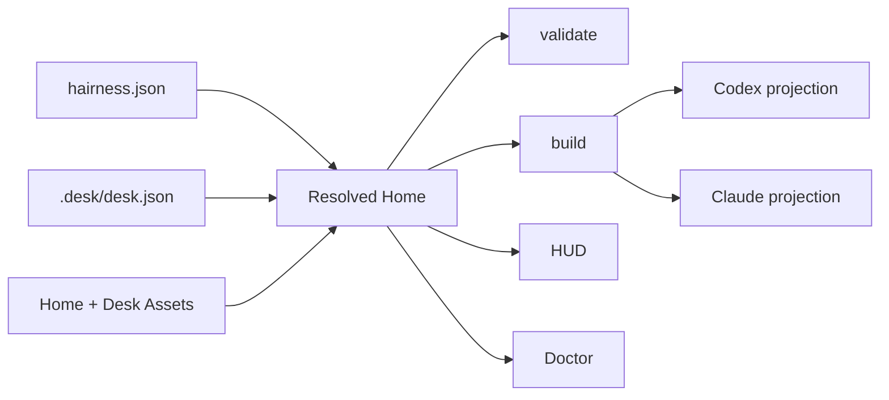

# Architecture

## Boundary

> The Kernel owns grammar, composition and safety. Assets own meaning,
> capabilities and surfaces.

`@hairness/cli` is the only package. The Kernel provides:

- document validation and source resolution;
- transactional Asset lifecycle;
- one deterministic Resolved Home;
- provider projection and output ownership;
- safe HUD probes and Doctor;
- staged executable output with digest-bound approval.

Assets declare Instructions, Capabilities, invocation surfaces, Artifact
kinds, CLI routes and settings. Installation or resolution never runs Asset
code.

## Resolution

The Resolved Home sorts canonical identities, checks references and settings,
detects collisions, calculates provider warnings and measures context bytes.
It is an in-memory value with a stable digest, not a lockfile.

## HAT

Hairness stabilizes three primitives:

- **Home** owns the durable, portable agent environment;
- **Asset** owns reusable agentic meaning and capability;
- **Target** remains an independent place where product work lives.

The resulting rules are Target Sovereignty, Projection Inversion, Progressive
Orientation and Context Mining. Hairness observes Targets without injecting
provider files into them; provider files remain projections; the compact HUD
precedes deeper context; durable value moves from sessions into owned Artifacts
and reusable Assets.

## Ownership

| Material | Owner | Place |
|---|---|---|
| Shared environment | Home | `hairness.json`, `assets/`, `artifacts/` |
| Collaborator-specific environment | Desk | `.desk/` |
| Product or repository work | Target | independent Git repository |
| Shared provider view | Kernel | tracked provider paths |
| Personal provider view | Kernel | local provider paths in team mode |
| Runtime state and trust | local Kernel | `.hairness/` |

The Home repository records shared history. In team mode, the Desk uses a
second private repository. Physical Target Bindings remain ignored local
checkouts or symlinks. One Target can have several named Bindings.

`Desk = Collaborator × Home`. A Desk is scoped to that relationship; it is
neither a provider profile nor a global user identity.

## Projectors

Provider modules own native paths and invocation mechanics. The Asset grammar
does not mention `AGENTS.md`, `CLAUDE.md` or provider Skill folders.

Projectors preserve human text outside Hairness managed regions. They generate
provider-native Skills and Commands from Home and Desk Assets. Home outputs are
shared; team Desk outputs are excluded locally from the Home Git repository.
Desk Instructions reach the session through the HUD prompt.

## HUD

The same Resolved Home renders dense text for humans, XML for the session-start
agent prompt and JSON for tools. Safe probes report local Git state, worktrees,
Target Bindings, Artifact state and context footprint. HUD resolution performs
no network request and executes no Asset.

## Executables

Declarative routes call a fixed set of Kernel operations. Executable routes and
build executables require approval bound to the current Asset digest.

Node's permission model limits filesystem reads to the Asset and writes to a
temporary staging directory. Hairness limits process duration and output size,
rejects symlinks and undeclared paths, then reconciles output ownership.
