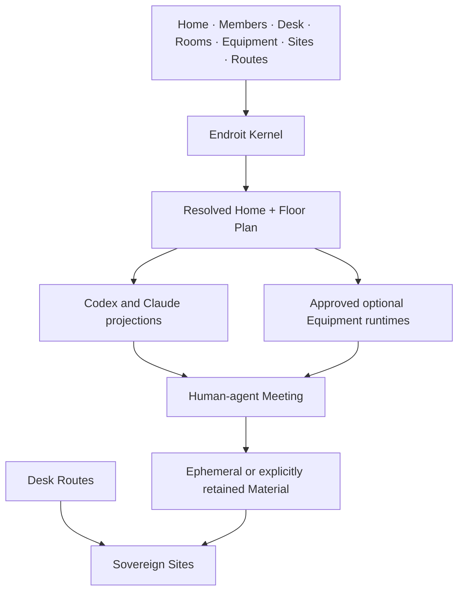

# Architecture

## Boundary

> The Home owns the workplace. Equipment equips it. Sites keep their truth.
> The Kernel resolves and projects explicit sources.



`@endroit/cli` is the only package. There is no daemon, registry service,
public Core package, graph store or required SaaS.

## Ownership

```text
Human     direction, judgment and acceptance
Home      shared workplace and composition
Member    Home-owned human identity and durable collaboration context
Desk      personal continuity and local access
Room      durable domain and Material
Meeting   bounded hot context
Equipment reusable way of working
Site      external truth, history and permissions
Route     declared local relationship to a Site
Runtime   session, permissions and execution
Occupant  temporary agent participating in one Meeting
Role      temporary working lens applied to an Occupant
```

Physical containment does not imply shared ownership. An Embedded Home and its
Site may share `.` while keeping distinct responsibilities.

## Kernel

The Kernel owns:

- Home, Member and Desk loading;
- schema and source validation;
- transactional Equipment lifecycle;
- deterministic workplace resolution;
- Site and Route declarations;
- safe managed clone and worktree operations;
- Front Door and provider projections;
- runtime digest trust and dispatch;
- static inspection.

It does not own model inference, a persistent agent, methodology output,
external permissions or Site-native truth.

## Progressive orientation

The generated Floor Plan is sufficient to enter a Home without a live service.
It contains stable relative sources and available runtime namespaces. A Wake-up
may add absolute paths, Git observations, activity and attention through the
HUD. If it fails, provider front doors keep the static Floor Plan.

`AGENTS.md`, `CLAUDE.md`, Skills and Commands are derived projections. Direct
edits are divergence, not source changes.

## Site and Route separation

```text
sites/product/SITE.md                 shared identity and orientation
.desk/routes/product/main.json        ignored local access declaration
.desk/sites/product/main/             optional ignored managed checkout
```

Site identity never depends on a symlink. Route metadata never depends on the
physical checkout surviving. A Route must be re-observed before mutation.

## Equipment trust

Static Equipment can be installed and projected without execution. A runtime
is dispatched only when its exact bytes are npm-bundled or locally approved.
Trust is content-addressed; mutations invalidate approval.

## Human-agent experience

Normal conversation is the default interface. The Front Door situates the
agent; Room ownership narrows relevant context; Equipment supplies optional
methods; Routes identify valid destinations. The human decides what is
retained, accepted, archived or delivered.
