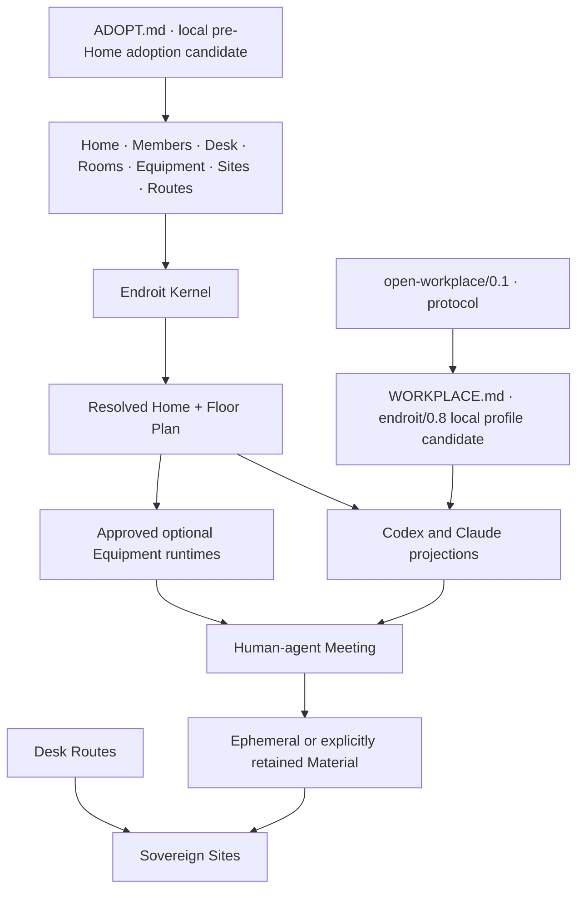

# Architecture

## Boundary

> Open Workplace defines the model. A Home owns one concrete workplace.
> Equipment equips it. Sites keep their truth. Endroit resolves and projects
> explicit sources.



`@endroit/cli` is the only package. There is no daemon, registry service,
public Core package, graph store or required SaaS.

`ADOPT.md` operates before a Home exists. It is a portable human-agent process,
not a scanner or Kernel command: explicit roots, read-only recognition,
candidate selection, deeper analysis, a separately approved map, then existing
CLI operations.

`WORKPLACE.md` is the self-contained local `endroit/0.8` Profile candidate
targeting the `open-workplace/0.1` protocol for an existing Home. It is owned as an
Instruction by `endroit/workplace`, so the existing build mechanism injects it
once into each generated `AGENTS.md` and `CLAUDE.md`. No Kernel branch,
parallel injection system or provider-specific copy implements this behavior.
It is included in the local `0.8.0-alpha.2` package candidate; publication is a
separate observed effect.

Git owns the 0.8 contract sources under `schemas/v7/`; the npm package carries
the same files for offline validation; `endroit.org/schema/v7/` gives them
stable public addresses. Runtime dispatch uses
`endroit.org/runtime/v2alpha1`. The CLI never downloads a schema to operate.

The experimental `endroit/work` Equipment owns Work Resolution. Kernel-owned
Artifact discovery supplies the same bounded inventory to the generic Artifact
and Work runtimes; the Equipment validates and resolves `WORK.json`. This adds
no graph store, daemon, scheduler or agent registry. The public Work schema is
a byte-identical projection of the Equipment source.

## Ownership

```text
Human     direction, judgment and acceptance
Home      shared workplace and composition
Member    Home-owned human identity and durable collaboration context
Desk      personal continuity and local access
Room      durable domain and Material
Meeting   bounded hot context
Equipment reusable way of working
Site      external truth, history and permissions
Route     declared local relationship to a Site
Runtime   session, permissions and execution
Occupant  temporary agent participating in one Meeting
Role      temporary working lens applied to an Occupant
```

Physical containment does not imply shared ownership. An Embedded Home and its
Site may share `.` while keeping distinct responsibilities.

## Kernel

The Kernel owns:

- Home, Member and Desk loading;
- schema and source validation;
- transactional Equipment lifecycle;
- deterministic workplace resolution, including validation and indexing of
  Site and Route sources;
- Front Door and provider projections;
- runtime digest trust and dispatch;
- static inspection.

Foundation Equipment owns operational surfaces. In particular,
`endroit/sites` owns Site and Route declaration changes, deterministic Git
inspection, managed clones and managed worktrees. The root CLI exposes `site`
and `route` as façades that dispatch this installed Equipment runtime; those
operations are not Kernel behavior.

It does not own model inference, a persistent agent, methodology output,
external permissions or Site-native truth.

## Progressive orientation

The generated Floor Plan is sufficient to enter a Home without a live service.
It contains stable relative sources and available runtime namespaces. A Wake-up
may add absolute paths, Git observations, activity and attention through the
HUD. If it fails, provider front doors keep the static Floor Plan.

`AGENTS.md`, `CLAUDE.md`, Skills and Commands are derived projections. Direct
edits are divergence, not source changes.

## Site and Route separation

```text
sites/product/SITE.md                 shared identity and orientation
.desk/routes/product/main.json        ignored local access declaration
checkouts/product/main/               ignored checkout or rebuildable Mount
```

Site identity never depends on a symlink. Route metadata never depends on the
physical checkout surviving. For an `existing` Route, a Mount is an optional
rebuildable symlink at the conventional checkout address; removing it never
touches its target. A Route must be re-observed before mutation.

For a submodule, the Home Git repository owns the Gitlink commit pin and
`.gitmodules` declaration. Checkout initialization and submodule lifecycle
remain user-owned; the Route only addresses the checkout.

## Equipment trust

Static Equipment can be installed and projected without execution. A runtime
is dispatched only when its exact bytes are npm-bundled or locally approved.
Trust is content-addressed; mutations invalidate approval.

## Human-agent experience

Normal conversation is the default interface. The Front Door situates the
agent; Room ownership narrows relevant context; Equipment supplies optional
methods; Routes identify valid destinations. The human decides what is
retained, accepted, archived or delivered.

The static foundation is sufficient: owned Markdown and JSON sources,
deterministic resolution, the Floor Plan and rebuildable provider projections.
HUD, Site tooling and other runtimes add operations but never become required
for the Workplace to describe itself.
