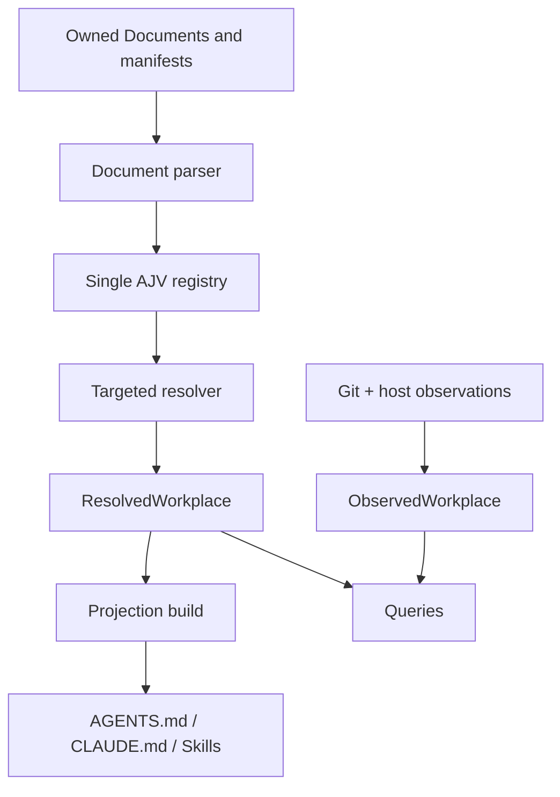

# Endroit 0.10 architecture

Endroit is a local compiler for owned workplace context. Open Workplace defines
shared responsibilities; the `endroit/0.10` Profile owns their concrete file,
resolution, validation, query and projection model.

## Ownership

| Authority | Owns |
| --- | --- |
| Open Workplace | Cross-implementation responsibilities and resolution states. |
| Endroit | Profile vocabulary, schemas, resolver, CLI, projections and migration. |
| Workplace | Its declaration, Members, shared Rooms and Equipment sources. |
| Desk | Local continuity, local Rooms, Routes and Checkout bindings. |
| Site/Git | Repository source, branches, worktrees, history and remote effects. |

Filesystem containment never transfers ownership.

## Canonical representations



`ResolvedWorkplace` is derived in memory. It includes identity, Profile,
runtime, source refs/owners/relative paths/digests, resolved Documents and
Fragments, Equipment, Capabilities, surfaces and Artifact kinds.

Its revision is the digest of the Profile, runtime and sorted
`(relative_path, source_digest)` pairs. Host paths, timestamps, Git state,
projection freshness and other observations are excluded.

`ObservedWorkplace` contains volatile facts: current Desk, projection
freshness, runtime availability, Git/Checkout state and diagnostics. Neither
representation is Material or an Artifact.

## Document pipeline

One parser handles human-owned v9 Documents:

- UTF-8 regular files only; symlinks are rejected;
- one `key: value` frontmatter pair per line;
- structured values use inline JSON;
- bare scalars are strings;
- duplicate keys, YAML nesting, anchors and tags are rejected;
- deterministic rendering sorts non-identity keys and serializes structure as
  JSON.

One AJV registry validates v9 Documents, Work contracts and legacy adapter
inputs. Public source/schema fields use `snake_case`. Historical camelCase
exists only inside the compatibility adapter or internal normalized shape.

Contract availability is broader than writer availability. The 0.10 candidate
writes v9 Workplace, Member, Desk and Route Documents. It validates the full v9
schema family as a product contract, but bundled Room and Site writers and most
Equipment and Artifact owners still use their compatible source shapes. A
schema existing in the registry is not evidence that an in-place migration or
writer exists. The exact matrix lives in the
[reference](reference.md#source-format-support).

A Markdown section may contain one first `endroit` fenced block. The block
types the Fragment; its substance runs to the next heading of equal or higher
level. Fragments inherit owner and lifecycle. Independent content is Material;
schema-validated autonomous Material is an Artifact.

## Discovery

`findWorkplace` walks physical parents from the explicitly selected starting
path. It ignores an ordinary `WORKPLACE.md` without the Endroit kind. The
first marked candidate stops discovery even when invalid. Discovery never
walks children, follows Routes, crosses repositories or scans global project
roots.

The legacy adapter reads `endroit.json` only when no v9 declaration competes
for the same boundary.

## Build

```text
resolve
→ validate fixed context budgets
→ render provider projections
→ detect path/owner collisions
→ write atomically
→ write .endroit/build.json
```

The receipt records the Workplace revision, input digests and each output's
path, kind/provider, owner, sources and digest. It is local, deterministic and
disposable.

Build does not install provider hooks, mutate host configuration or edit Git
excludes. Generated paths are protected: an unrecognized file or a generated
file changed since its receipt causes a collision/divergence error.

## Provider context

Codex and Claude use the same semantic source. Provider adapters only select
paths and provider syntax. Each bootstrap is at most 4,096 bytes and carries:

- Workplace, Profile, protocol and revision;
- concise Constitution;
- source/projection rule;
- minimum routing and authority constraints;
- local console and degraded behavior.

The Profile, complete inventories, unrelated Rooms/Sites and absolute paths are
excluded. Foundation Skills are the six explicit gestures declared by
`endroit/workplace`; Rooms and Sites do not generate their own Skills.

## Route and Checkout topology

A v9 Route owns no physical path. Its address is derived as
`checkouts/<site>/<route>`. Its purpose is one of `primary`, `development`,
`integration`, `release`, `dogfood`, `recovery` or `experiment`. Implicit
operations select the single active `primary` Route; other purposes require an
explicit Route.

The binding authority is shared by every Home worktree of the same Git
repository at
`<commonGitDir>/endroit/desks/<desk>/checkout-bindings.json`. A non-Git Home
uses `.endroit/desks/<desk>/checkout-bindings.json`. The canonical v1 document
contains sorted `{site, route, target}` bindings, absolute targets, a digest
and a sibling lock.

`.endroit/checkout-index.json` v3 is only the active Home worktree's projection:
`{version, desk, projections}`. Each projection records its conventional
address, bound target, link state and digest. It never owns a binding and never
contains another Desk or Home worktree's projections. A lost owned symlink can
be rebuilt from the shared binding; an unindexed symlink remains a conflict.

Managed clones/worktrees are physical below
`<commonGitDir>/endroit/checkouts/<site>/<route>` (or the non-Git fallback under
`.endroit`) and normally project a symlink at their conventional Home address.
Existing and submodule targets may be direct or linked. When the `self` target
is the Home or an ancestor/descendant, the projection is `relational` and no
symlink is created.

Git observations are read from the resolved repository. Extra worktrees are
enumerated only through the common Git directory of known Site repositories.

## Compatibility and migration

0.10 uses `read_old, write_new` only where a native v9 writer exists:

- v7 declarations and Route v8 are accepted only through the legacy adapter;
- v9 plus legacy for one identity is `ambiguous_sources`;
- ordinary mutation of legacy sources is refused;
- Route migration advances v7→v8 first, then v8→v9 and requires an explicit or
  deterministic v9 purpose;
- the Workplace upgrade core can convert v7/v8 directly to v9 while extracting
  v1/v2 index bindings into the shared v1 authority and writing a v3 projection;
- apply is journaled under `.endroit/migrations/`;
- rollback restores source bytes and mode exactly;
- migration runs no Git mutation.

The upgrade core exposes a digest-bound plan plus approved apply and exact
rollback. Product-level migration of Workplace/Desk/Member declarations,
first-party Equipment synchronization and projection rebuild are composed by
the command layer; the Route/binding core does not claim those effects.

## Documentation delivery

Files in this repository are Endroit-owned product source. A documentation
repository or public site is a projection owner, not a second canon. A
projection lock records source repository, ref/commit, source digest,
transform version and output digest. Public “current release” pages advance
only after the release effect has been observed; candidates render as previews
identified by commit and digest.
