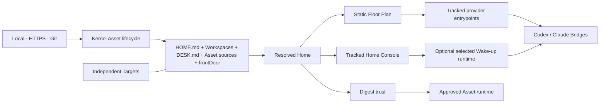

# Architecture

## Boundary

> Assets provide. The Home composes. The Kernel enforces. Bridges deliver.



`@endroit/cli` is the only package. There is no public Core package, Registry,
Adapter layer or package dependency graph.

## Environment responsibilities

Home-first defines the responsibilities of a durable human-agent environment;
Endroit gives them concrete owners:

```text
Places          → Home · Desk · Workspaces · Workstreams
Orientation     → Front Door · Floor Plan · HUD · Maps
Capabilities    → Assets · Capabilities · Projections
Material        → Documents · decisions · Artifacts
Relationships   → Targets · Bindings · Handles · external systems
```

Material is durable shared content, not an automatic transcript or a copy of
live Target truth. Relationships retain routes and authority without absorbing
the connected repository or external system.

## Kernel

The Kernel contains:

- Home and Desk loading;
- strict loading of the canonical `HOME.md` and `DESK.md` sources;
- JSON schema validation;
- source resolution and transactional Asset lifecycle;
- deterministic Resolved Home composition;
- Front Door route validation and the provider-neutral Floor Plan;
- tracked Home Console generation;
- projection ownership and provider Bridges;
- runtime digest trust and dispatch;
- static Doctor checks.

It does not know the output format or business behavior of HUD, Artifacts or
Targets. It does not author behavioral instructions. It only validates, orders,
attributes and projects explicit sources.

## Front Door and Progressive Orientation

The Front Door is a composition, not an Asset:

```text
Front Door
├── Floor Plan        static, deterministic, always available
├── Wake-up           one optional <asset-id>:<command> route
├── provider Bridge   bounded stdout transport
└── Home Console      node ./endroit.mjs …
```

`endroit.json#frontDoor.wakeUp` selects at most one command already provided
by an effective Asset runtime. The Resolved Home verifies the owner, namespace
and command. Asset mutations that would break the selected route fail before
writing.

Build projects `HOME.md → Floor Plan → Home Asset Instructions`. The Floor Plan
contains only stable relative facts. Wake-up can add absolute paths, Git state,
dates, trust and attention, but its failure cannot remove static orientation.
This is Progressive Orientation.

Bridges do not parse HUD, XML or another Asset protocol. At SessionStart they
invoke the selected route through `endroit.mjs`, cap it at 30 seconds and
256 KiB, discard stderr and transport stdout in the provider-native envelope.

The Front Door situates the agent in the owned environment. It is not only an
instruction injector. Endroit remains structurally explicit so normal
conversation can be the common interface; Skills and Commands expose precision
surfaces when a person or runtime needs them.

## First-party Assets

First-party sources live under `assets/endroit/*`, exactly where third-party
Assets live in a Home. Their `asset.json` manifests declare every public
surface. Runtime code lives beside the manifest that owns it.

HUD intentionally understands the official Workspace, Artifact and Target contracts so it
can render a coherent first-party view without executing other runtimes. It
normalizes Workspaces, Workstreams, Targets and Capabilities as Routable Items:
`kind`, `id`, `state`, `summary`, `when`, `tags`, `ref`, `access` and
`routable`. Their owning sources remain authoritative; HUD is only a projection.
Generic third-party HUD contributions are outside 0.7.

Activity is another HUD view. It computes recent attributed observations from
Git, regular files and Endroit metadata without creating an event store.
Endroit metadata is `authoritative`; Git and filesystem evidence is
`observed`.

## Ownership

- Home sources, shared Workspaces and projections are Git-tracked.
- Desk Workspaces are personal to `Collaborator × Home`.
- Artifacts live under their owning Workspace namespace and name their lineage.
- Targets retain independent repositories.
- External systems are projections linked to local Publications by Handles.
- Provider projections are derived views.
- `.endroit/` contains local rebuildable state and approvals only.

This arrangement keeps the Home legible while leaving methodologies, external
systems and project repositories sovereign.

> A good abstraction hides mechanics—not ownership.

Capabilities remain source-owned even when their activation is runtime-native:

```text
Asset → Capability → Projection → Surface
      → conversation or command activation → Asset runtime → Artifact
```

This is a responsibility chain, not an assertion that every Capability has an
executable runtime or produces an Artifact.

`HOME.md` is the shared constitution. `DESK.md` specializes it for one
collaborator without replacing it. Home Asset Instructions follow `HOME.md` in
deterministic Asset and instruction order, after the generated Floor Plan.
`DESK.md` and Desk Asset Instructions may be supplied by the selected Wake-up
route rather than written into shared files. `AGENTS.md` and `CLAUDE.md` are
fully owned projections: a direct edit is reported as divergence.

## Self-hosted development

The Endroit repository remains a Target, not a colocated Home. Its
repository-local orchestrator builds a sibling team Home and binds this checkout
as `endroit/main`:

```text
Agentic Tools Home ──Target──> Endroit repository
Agentic Tools Home ──Target──> Endroit Development Home
Endroit Development Home ──Binding──> Endroit repository
```

The Development Home installs `endroit/project` through that Binding.
Its ignored regular `.endroit/dev-cli` file points the tracked Home Console at
the source checkout. The Console alone selects `development|npm`; a broken
development launcher never falls back. This keeps product sources clean while
exercising the same Home, Desk, Asset, Front Door and Target contracts shipped
to users.
