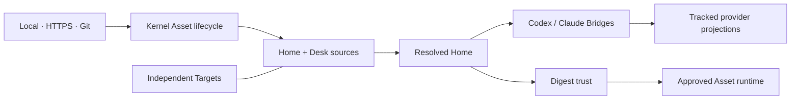

# Architecture

## Boundary

> The Kernel owns grammar, composition, source lifecycle, projection safety and
> trust. Assets own meaning, capabilities, surfaces and runtime behavior.

`@hairness/cli` is the only package. There is no public Core package, Registry,
Adapter layer or package dependency graph.

## Kernel

The Kernel contains:

- Home and Desk loading;
- JSON schema validation;
- source resolution and transactional Asset lifecycle;
- deterministic Resolved Home composition;
- projection ownership and provider Bridges;
- runtime digest trust and dispatch;
- static Doctor checks.

It does not know the business behavior of HUD, Artifacts or Targets.

## First-party Assets

First-party sources live under `assets/hairness/*`, exactly where third-party
Assets live in a Home. Their `asset.json` manifests declare every public
surface. Runtime code lives beside the manifest that owns it.

HUD intentionally understands the official Artifact and Target contracts so it
can render a coherent first-party view without executing other runtimes. Generic
third-party HUD contributions are outside 0.5.

## Ownership

- Home sources and shared projections are Git-tracked.
- Desk sources are personal to `Collaborator × Home`.
- Artifacts name their owner and lineage.
- Targets retain independent repositories.
- Provider projections are derived views.
- `.hairness/` contains local rebuildable state and approvals only.

This arrangement keeps the Home legible while leaving methods and project
repositories sovereign.
