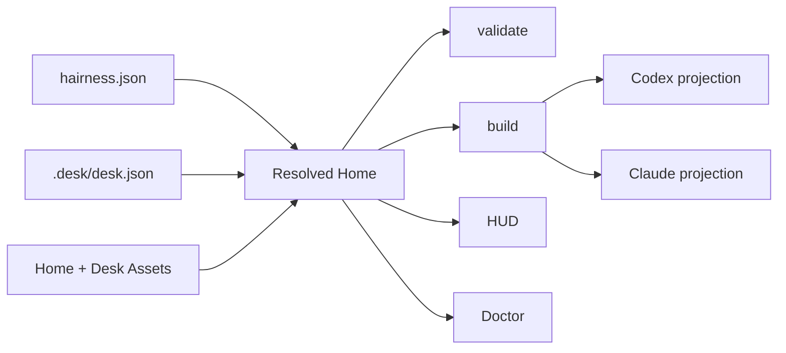

# Architecture

## Boundary

> The Kernel owns grammar, composition and safety. Assets own meaning,
> capabilities and surfaces.

`@hairness/cli` is the only package. The Kernel provides:

- document validation and source resolution;
- transactional Asset lifecycle;
- one deterministic Resolved Home;
- provider projection and output ownership;
- safe HUD probes and Doctor;
- staged executable output with digest-bound approval.

Assets declare Instructions, Capabilities, invocation surfaces, Artifact
kinds, CLI routes and settings. Installation or resolution never runs Asset
code.

## Resolution

The Resolved Home sorts canonical identities, checks references and settings,
detects collisions, calculates provider warnings and measures context bytes.
It is an in-memory value with a stable digest, not a lockfile.

## Ownership

| Material | Owner | Place |
|---|---|---|
| Shared environment | Home | `hairness.json`, `assets/`, `artifacts/` |
| Collaborator-specific environment | Desk | `.desk/` |
| Product or repository work | Target | independent Git repository |
| Generated provider view | Kernel | tracked provider paths |
| Runtime state and trust | local Kernel | `.hairness/` |

The Home repository records shared history. In team mode, the Desk uses a
second private repository. Physical Target bindings remain ignored symlinks.

## Projectors

Provider modules own native paths and invocation mechanics. The Asset grammar
does not mention `AGENTS.md`, `CLAUDE.md` or provider Skill folders.

Projectors preserve human text outside Hairness managed regions. They generate
shared Instructions and provider surfaces from the Resolved Home. Desk
Instructions reach the session through the HUD prompt.

## Executables

Declarative routes call a fixed set of Kernel operations. Executable routes and
build executables require approval bound to the current Asset digest.

Node's permission model limits filesystem reads to the Asset and writes to a
temporary staging directory. Hairness limits process duration and output size,
rejects symlinks and undeclared paths, then reconciles output ownership.
