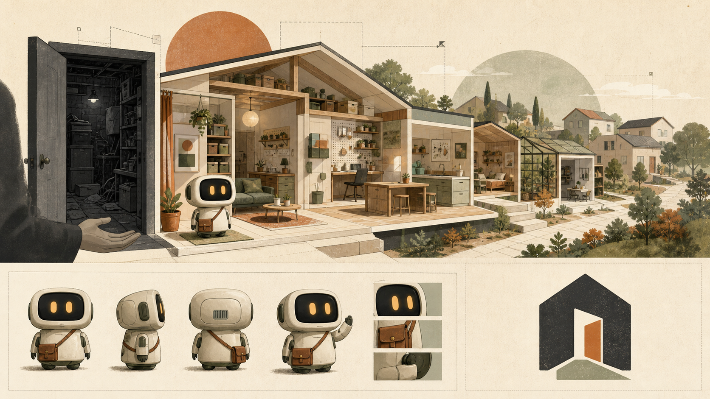
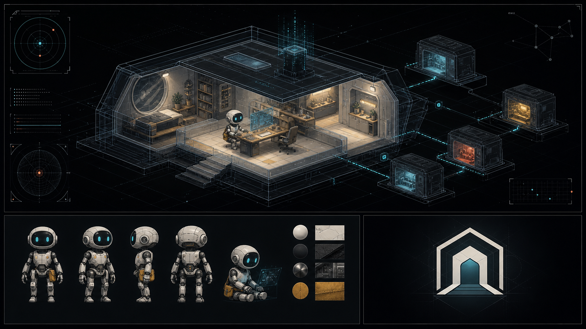
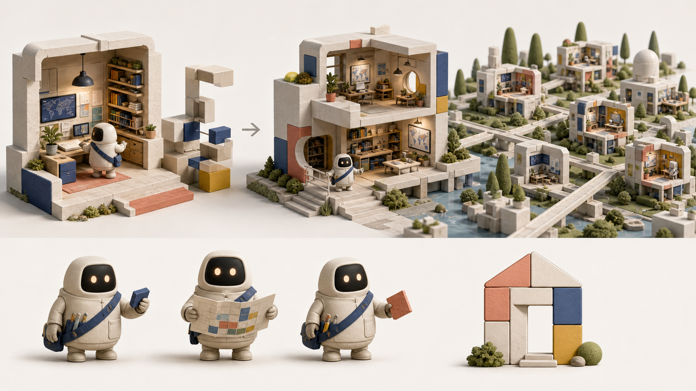

# Hairness 0.5 visual directions

These concept boards explore one hero, Ness and one Home mark as a coherent
system. No direction is selected.

## 01. Architectural field guide

Warm editorial illustration with an explicit storage closet to Home story.
The mark uses an open doorway. This direction carries the strongest empathy and
the clearest before-and-after narrative.

SHA-256: `b1f75198681d2c97bf3ba1a36f1b07ca9b970fe36c237cbad1166390a30dcbfc`

## 02. Legible blueprint

An inspectable technical habitat in a dark unknown space. The HUD and connected
modules fit the 0.5 framework model. This direction makes the Resolved Home and
the Kernel boundary visible.

SHA-256: `b1d6127a5e9738333961593ac62c9b9606f844b95a3dcd3c8f8c312acaba2a7f`

## 03. Living blocks

Tactile rooms assemble into a Home, then a city. Modular geometry supports the
Asset and team story. This direction has the most extensible visual language
for future ecosystem material.

SHA-256: `91ff1ea81638f04449ea28773a8db3bfb70def07da5af21a1838c9c2928ea062`

## Locked criteria

- Ness is the agent resident and must evoke empathy, relief and competence.
- The logo represents the Home, not Ness.
- The tone remains adult and usable for technical or non-technical Homes.
- Final text and wordmarks use deterministic composition outside the generated
  illustration.
- The selected direction must produce a README hero, a 1200×630 social card,
  a Ness reference and a terminal proof.
