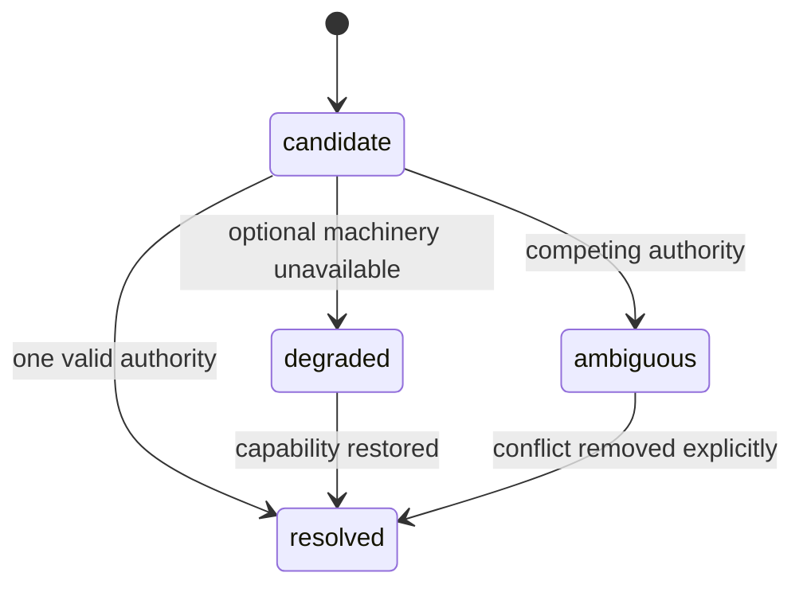
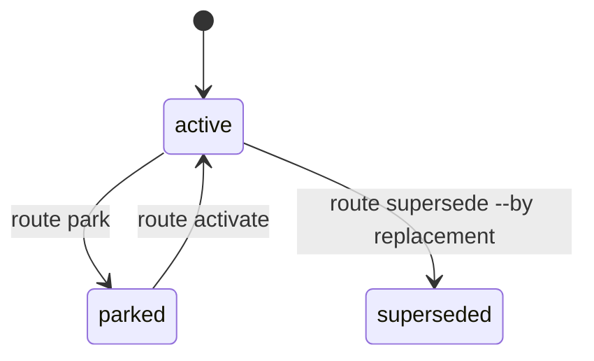

# Endroit 0.10 lifecycles

Endroit keeps independent questions independent. Producing text does not make
it durable, true, accepted, complete or delivered.

## Workplace resolution



An invalid marked `WORKPLACE.md` stops discovery. Endroit does not search past
it for a more convenient authority.

## Work event and Material

Every provider session begins as an ephemeral Meeting.

```text
ephemeral candidate
  ├─ retain  → retained Material
  ├─ accept  → acceptance for an exact revision
  ├─ discard → no durable record
  └─ deliver → only through a revalidated Route, with observed result
```

Material lifecycle is:

```text
ephemeral | retained | archived
```

Acceptance is a separate revision-bound record. It does not automatically
retain, archive, complete or deliver the Material. Archival removes Material
from the active set without erasing history.

A review stays a Fragment of `WORK.md` unless it needs independent mutation,
acceptance or lifecycle; only then does it become autonomous Material such as
`REVIEW.md`.

## Claim state

Currentness:

```text
current | superseded | withdrawn
```

Claim maturity:

```text
proposed | supported | demonstrated
```

A demonstrated claim may be withdrawn. A current claim may still be proposed.
Neither axis implies human acceptance.

## Work activity and completion

Work activity:

```text
active | paused | closed
```

Completion:

```text
complete | incomplete | blocked
```

Completion is calculated for an exact `(contract, revision, evidence)` tuple.
It is never stored as `final` or as a boolean in `WORK.md`. Any source digest
change creates a new revision and invalidates the prior completion result.

A revision may be complete for one contract while its Work remains active and
modifiable.

## Delivery

Delivery observation:

```text
succeeded | partial | failed
```

Delivery is an observed effect in a sovereign Site. It requires:

1. an explicitly selected Site and Route;
2. current Route and Checkout revalidation;
3. separate host permission and human consent for the intended mutation;
4. execution in the Site-owned repository or system;
5. observation of the resulting effect.

A successful delivery does not imply acceptance, completion, archival or
currentness. A failed or partial delivery advances none of those axes.

## Route lifecycle



These transitions modify Route metadata only. They do not move, clean, switch
or delete a Checkout.

Managed Checkout deletion is a distinct approved operation. Existing and
submodule checkouts are never deleted by Route removal.

## Checkout binding

Bindings are shared per Desk across Git worktrees; the Home index is a local
projection only.

```text
explicit adopt/creation
  → lock and write commonGitDir/endroit/desks/<desk>/checkout-bindings.json
  → materialize conventional address
  → write this Home's .endroit/checkout-index.json v3 projection
  → inspect/reconcile from shared truth
```

If a generated link is lost, reconcile can rebuild it from the shared binding.
If a link is unindexed, reconcile reports a conflict and performs no adoption
or deletion. Relational self targets resolve without a symlink.

## Source migration

```text
legacy v7 Route
  → route migrate --check
  → journaled v7 → v8
  → optional exact rollback

legacy v8 Route
  → route migrate --check
  → journaled v8 JSON → v9 ROUTE.md
  → optional exact rollback

Workplace upgrade plan
  → deterministic purpose and binding proposal
  → expect-plan + workplace approval + clean Home Git
  → journaled direct v7/v8 → v9 and index v1/v2 → binding v1 + index v3
  → verification
  → applied or automatic exact rollback
```

Preview is read-only and creates no lock or journal. Apply takes the exclusive
Route writer lock, snapshots source bytes/modes, validates drift and writes one
compatibility step. Rollback is resumable and restores bytes/modes exactly.
Route migration changes no repository, branch, HEAD, working tree, Gitlink or
Checkout binding. Workplace upgrade changes its declared Route/binding/index
set transactionally but performs no Git mutation. A later explicit rollback
refuses drift and restores exact bytes and modes.

## Projection lifecycle

```text
owned source change
  → ResolvedWorkplace revision changes
  → build --check reports stale
  → build writes atomically
  → .endroit/build.json records digests
```

Provider projections are disposable. Editing one never advances a source
lifecycle; a divergent generated path must be rebuilt from its owner.
